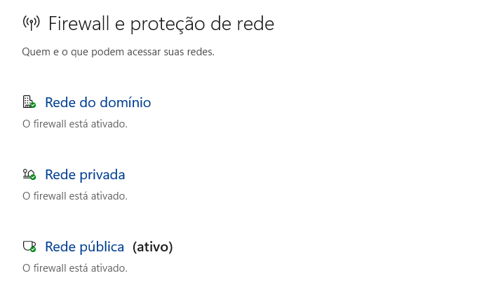

# Auditoria de Firewall

## Verificação

- Firewall habilitado: Sim
- Perfil Privado protegido: Sim
- Perfil Público protegido: Sim

## Observações

O firewall do Windows encontra-se ativo e protegendo as conexões de rede.