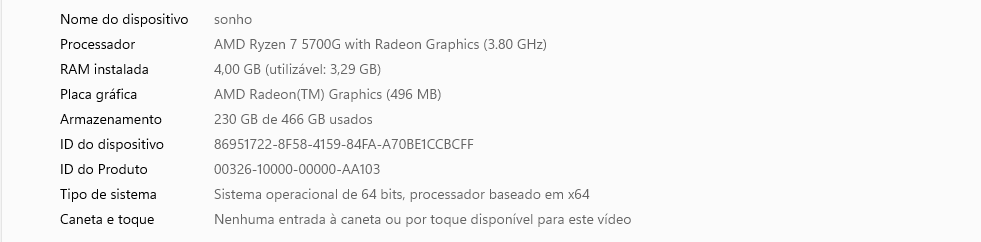

# Informações do Sistema

Data da auditoria: 14/06/2026

## Equipamento

Nome do computador:
sonho

Sistema Operacional:
Windows 11

Tipo de Sistema:
64 bits

Processador:
AMD Ryzen 7 5700G with Radeon Graphics (3.80 GHz)

Memória RAM:
4,00 GB (utilizável: 3,29 GB)