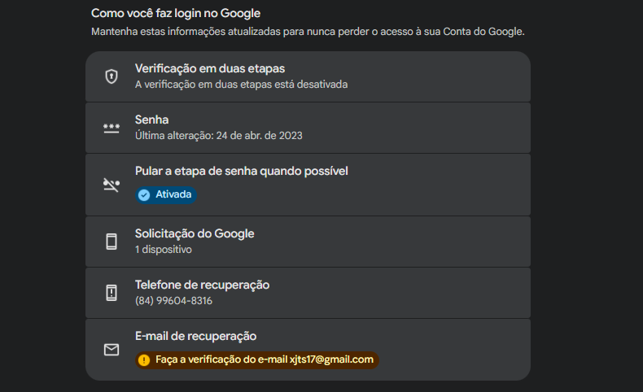
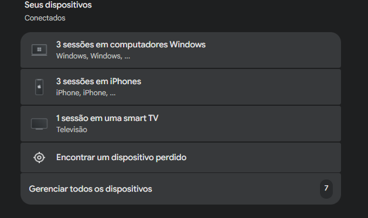
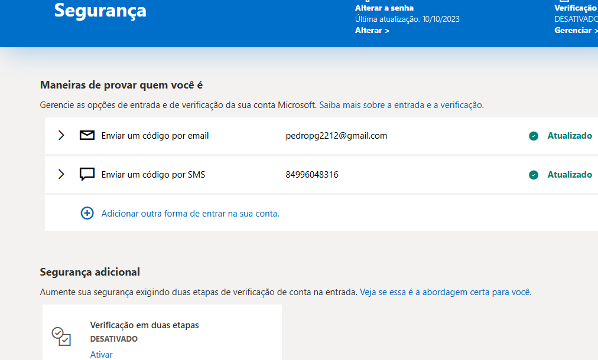

# Autenticação Multifator (MFA)

 
 

## O que é MFA?

MFA (Multi-Factor Authentication) é um mecanismo de segurança que exige mais de uma forma de autenticação para acessar uma conta.

## Exemplos

- Senha + código enviado ao celular
- Senha + aplicativo autenticador
- Senha + biometria

## Benefícios

- Reduz risco de invasão
- Protege contra vazamento de senhas
- Aumenta a segurança das contas

## Aplicação na Auditoria

Foi verificado se as contas Microsoft e Google possuem mecanismos adicionais de autenticação.