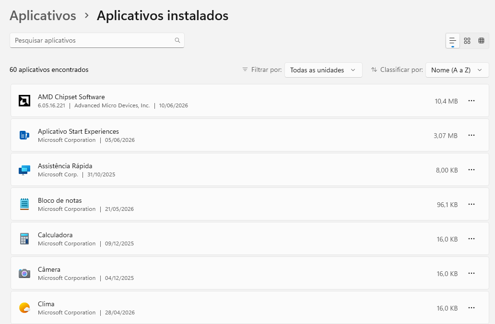
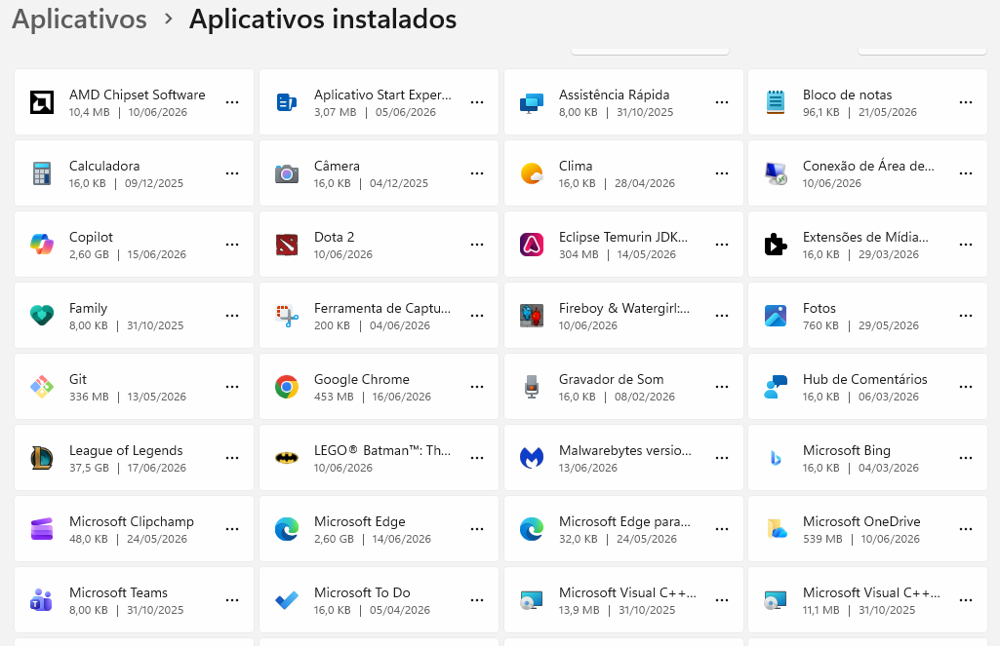

Programas Instalados
Evidências

Print disponível em:

Google Chrome

Antivírus

Malwarebytes

Observação: o sistema também utiliza as proteções nativas do Microsoft Defender.

Ferramentas de Acesso Remoto

Foi identificada a ferramenta Assistência Rápida, recurso nativo do Windows utilizado para suporte remoto.

Não foram identificados softwares de terceiros como AnyDesk, TeamViewer ou RustDesk.

Inventário Básico de Software
Categoria	Software
Navegador	Google Chrome
Navegador	Microsoft Edge
Segurança	Malwarebytes
Desenvolvimento	Visual Studio Code
Desenvolvimento	Git
Desenvolvimento	Eclipse Temurin JDK
Comunicação	Microsoft Teams
Armazenamento	Microsoft OneDrive
Jogos	League of Legends
Jogos	Dota 2
Jogos	LEGO Batman
Observações

Foi realizado um levantamento básico dos aplicativos instalados no sistema. Foram identificadas ferramentas de desenvolvimento, produtividade, navegação web e entretenimento.

A presença do Git, Visual Studio Code e Eclipse Temurin JDK indica um ambiente utilizado para estudos e atividades relacionadas à tecnologia da informação.

Conclusão

O inventário de softwares auxilia na identificação dos programas instalados, contribuindo para a organização do ambiente e para a análise básica de segurança do sistema.